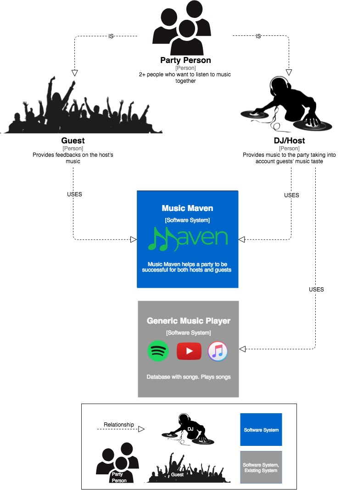
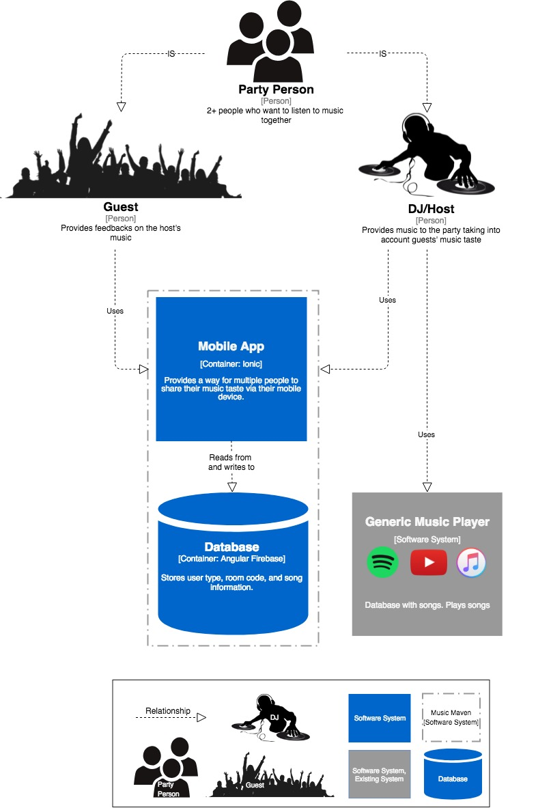

# Music Maven
An application for sharing song requests with your friends! One person is the 
DJ and other members of the party are the guests. The DJ can add/delete songs and
refer to the list to play the songs that the guests want played.
The guests can add songs and vote up/down on that they have added.

This is a project for COMP225: Software Development at Macalester College.

Old repository: https://github.com/ahelfins/Democratic-DJ

# Installation Guide

# System Context Diagram

# Container Diagram

