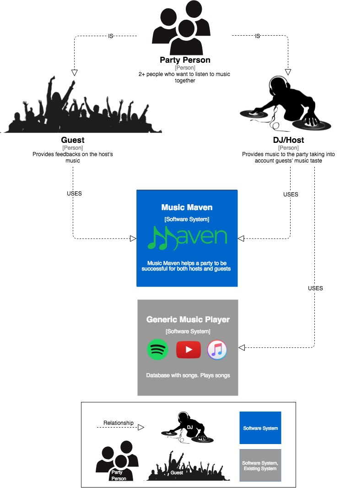

# Music Maven
An application for sharing song requests with your friends! One person is the 
DJ and other members of the party are the guests. The DJ can add/delete songs and
refer to the list to play the songs that the guests want played.
The guests can add songs and vote up/down on that they have added.

This is a project for COMP225: Software Development at Macalester College.

Old repository: https://github.com/ahelfins/Democratic-DJ

## Features

## Installation Guide
### Installing Ionic View

## Issues
* Negative song votes appear occasionally
* Multiple kickout alerts prompted for Guest exits and re-enters the same room
* Kickout alert prompted for Guest who exitted the room already
* Guest does not get kicked out when adding a song at the same time as Host ending the party

## System Context Diagram

## Container Diagram

